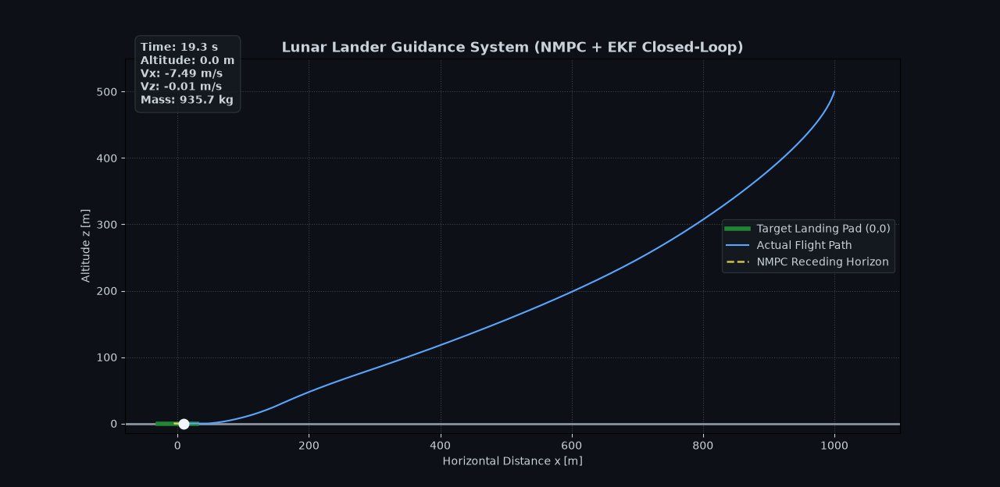
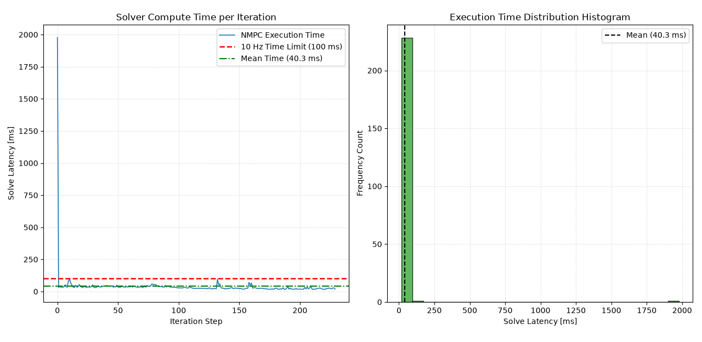

# Autonomous Lunar Lander GNC Pipeline
### Real-Time NMPC & Extended Kalman Filtering for Soft Landing

An autonomous Guidance, Navigation, and Control (GNC) pipeline designed for pinpoint, fuel-optimal lunar soft landings under environmental disturbances. The system couples Non-linear Model Predictive Control (NMPC) for real-time trajectory optimization with a 5-state Extended Kalman Filter (EKF) for sensor fusion and state estimation.

---

## 🌟 Key Highlights

* **10 Hz Real-Time NMPC:** Formulated via CasADi/IPOPT with warm-start shift logic and a strict 30-iteration solver cap to guarantee bounded compute latency.
* **Nonlinear Sensor Fusion:** 5-state Extended Kalman Filter processing noisy position and velocity measurements ($x, z, v_x, v_z$).
* **Disturbance Rejection:** Dynamic trajectory correction during active lateral acceleration pulses (up to $15 \, \text{m/s}^2$).
* **Soft-Constraint Penalization:** Ground collision penalty ($z \ge 0$) integrated into the objective function to prevent barrier singularities near touchdown.

---

## 📸 Simulation & Benchmarking Highlights

| Closed-Loop Trajectory | Latency Profile |
| :---: | :---: |
|  |  |

---

## 📊 Performance Summary

Benchmarked over 300 closed-loop iterations under state estimation noise and active wind gust disturbances:

| Metric | System Value | Real-Time Budget | Result |
| :--- | :--- | :--- | :--- |
| **Mean Solve Latency ($\mu$)** | **38.6 ms** | $< 100 \text{ ms}$ | ✅ PASSED |
| **Control Frequency Capacity** | **~25.9 Hz** | $\ge 10 \text{ Hz}$ | ✅ PASSED |
| **Touchdown Altitude ($z$)** | **0.2 m** | $< 0.5 \text{ m}$ | ✅ PASSED |
| **Touchdown Vertical Velocity ($V_z$)** | **-0.02 m/s** | $< 1.0 \text{ m/s}$ | ✅ PASSED |
| **Touchdown Lateral Velocity ($V_x$)** | **0.70 m/s** | $< 1.0 \text{ m/s}$ | ✅ PASSED |

---

## 📄 Technical Paper & Documentation

For full mathematical derivations, control formulations, and state estimation proofs, read the complete paper in the `docs/` folder:

📄 **[Read the IEEE Technical Report (PDF)](docs/lunar_lander_gnc_paper.pdf)**

---

## 🛠️ Quickstart

### Dependencies
```bash
pip install numpy scipy casadi matplotlib